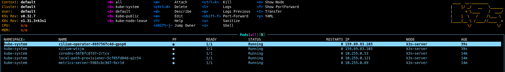

One more thing needs to be preconfigured before we can apply the Argo App of Apps. Take IPs from the Terraform output and add them to metallb-config.yaml file in [k3s0-ops](https://github.com/Ujstor/k3s-single-node-multi-cluster-iac/blob/master/cluster/k3s0-ops/helm/system/metallb-config/values.yaml) and [k3s1-app](https://github.com/Ujstor/k3s-single-node-multi-cluster-iac/blob/master/cluster/k3s1-app/helm/system/metallb-config/values.yaml) Helm charts. These IPs will be used by MetalLB to assign external IPs to services.

```bash
metallb-config:
  ipAddressPool:
    addresses:
     - 192.168.1.1/32

  l2Advertisement:
    enabled: true
```
Push changes to the GitHub repository and ArgoCD will apply them after the next steps.

## Install Cilium:

Change directory to the k3s0-ops Cilium Helm chart config and run:

```bash
helm install cilium . -n kube-system
```
Observe in k9s when networking is applied: CoreDNS, local-path-provisioner, and metrics-server pods will be running and cluster IPs will be assigned.



## Install Argo CD:

Create a namespace for Argo CD:

```bash
kubectl create namespace gitops
```

Change directory to the k3s0-ops Argo CD Helm chart config and run:

```bash
helm install argocd . -n gitops
```
Check when ArgoCD is installed, you can do port-forwarding to the ArgoCD pod and log in with the password that can be grabbed from the secrets (use k9s, it's easier than raw kubectl commands).


Finaly apply k3s0 `aoa.yaml` in the `gitops` namespace:

```bash
kubectl apply -f cluster/k3s0-ops/helm/aoa.yaml -n gitops
```
In 5 minutes, other components of the K3s0 cluster will be deployed.

## Add K3s1 cluster to ArgoCD

There are a couple of ways to add K3s1 to ArgoCD. The easiest way is to use the [CLI](https://kostis-argo-cd.readthedocs.io/en/refresh-docs/getting_started/install_cli/
) by referencing the K3s1 kubeconfig file:

```bash
argocd login argocd.k3s0.ujsto.com
argocd cluster add default --kubeconfig ~/.kube/k3s1-app --name default --grpc-web
```

and apply k3s1 `aoa.yaml` in k3s0 to deploy the K3s1 cluster:

```bash
kubectl apply -f cluster/k3s1-app/helm/aoa.yaml -n gitops
```
Cluster K3s1 will be deployed for 0 to hero.

## Note
Alternativley you can crate service account and token for ArgoCD in k3s1:

```yaml
apiVersion: v1
kind: ServiceAccount
metadata:
  name: argocd-manager
  namespace: kube-system
---
apiVersion: rbac.authorization.k8s.io/v1
kind: ClusterRole
metadata:
  name: argocd-manager-role
rules:
- apiGroups:
  - '*'
  resources:
  - '*'
  verbs:
  - '*'
- nonResourceURLs:
  - '*'
  verbs:
  - '*'
---
apiVersion: rbac.authorization.k8s.io/v1
kind: ClusterRoleBinding
metadata:
  name: argocd-manager-role-binding
roleRef:
  apiGroup: rbac.authorization.k8s.io
  kind: ClusterRole
  name: argocd-manager-role
subjects:
- kind: ServiceAccount
  name: argocd-manager
  namespace: kube-system
---
apiVersion: v1
kind: Secret
metadata:
  name: argocd-manager-token
  namespace: kube-system
  annotations:
    kubernetes.io/service-account.name: argocd-manager
type: kubernetes.io/service-account-token
```

and k3s1-cluster-secret.yaml in k3s0:

```bash
#k3s1
ca=$(kubectl get -n kube-system secret/argocd-manager-token -o jsonpath='{.data.ca\.crt}')
token=$(kubectl get -n kube-system secret/argocd-manager-token -o jsonpath='{.data.token}' | base64 --decode)

```

```yaml
apiVersion: v1
kind: Secret
metadata:
  name: k3s1-cluster-secret
  labels:
    argocd.argoproj.io/secret-type: cluster
type: Opaque
stringData:
  name: cluster-1
  server: https://api.k8s1.ujstor.com:6443
  config: |
    {
      "bearerToken": "${token}",
      "tlsClientConfig": {
        "serverName": "https://api.k8s1.ujstor.com",
        "caData": "${ca}"
      }
    }
```

```bash
#k3s0
kubectl apply -f k3s1-cluster-secret.yaml -n gitops
```

